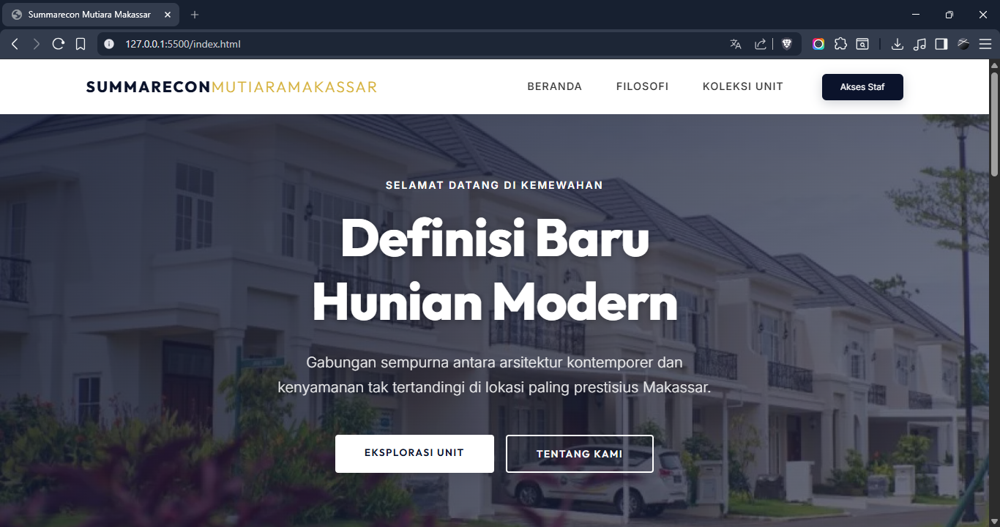
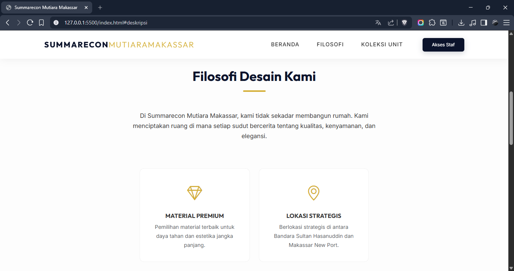

# UTS Pemrograman Web - Website Perumahan "Summarecon Mutiara Makassar"

Proyek ini adalah implementasi template website profil perumahan yang dirancang untuk memenuhi kriteria tugas UTS Pemrograman Web. Website ini berfokus pada estetika minimalis, elegan, dan profesional tanpa menggunakan JavaScript.

## Fitur Utama

1.  **Landing Page (`index.html`):** Informasi publik mengenai unit rumah, deskripsi proyek, dan galeri visual.
2.  **Halaman Login (`login.html`):** Antarmuka otentikasi untuk staf administrasi.
3.  **Halaman Dashboard Admin (`admin.html`):** Manajemen inventaris unit perumahan menggunakan tabel data dan formulir input.

## Tampilan Website

### Landing Page - Beranda


### Landing Page - Filosofi


### Landing Page - Koleksi Unit


### Halaman Login


### Halaman Dashboard Admin


## Struktur Folder

```text
uts-pemrograman-web/
├── css/
│   └── style.css      # Custom styling & overrides
├── img/               # Folder untuk aset gambar konten
├── public/            # Folder untuk tangkapan layar (screenshot) website
├── admin.html         # Halaman Dashboard Admin
├── index.html         # Halaman Utama / Landing Page
├── login.html         # Halaman Login Staf
└── README.md          # Dokumentasi proyek
```

## Cara Penggunaan

Cukup buka file `index.html` di browser pilihan Anda. Navigasi tersedia di bagian atas untuk berpindah antar bagian halaman atau menuju halaman login staf. Proyek ini murni menggunakan HTML dan CSS (termasuk *Bootstrap* versi CSS).
